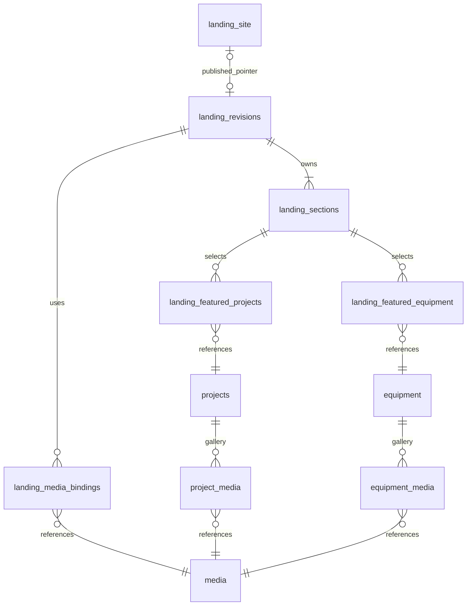

# Thiết kế DB cấu hình landing page

Ngày: 27/09/2026. Phạm vi tài liệu: schema nội dung landing và catalog. [Core kết nối](backend-core.md) đã triển khai runtime validator, read-only API và frontend đọc DB; admin/publish HTTP và kết nối Neon thật chưa được hoàn tất.

**Kết quả:** 11 bảng PostgreSQL, JSON Schema cho nội dung, seed bám theo source hiện tại, cùng kiểm thử trên PostgreSQL local tạm. Landing có bản nháp và bản xuất bản riêng; publish đổi toàn bộ bộ cấu hình trong một transaction. Đây là bổ sung phạm vi **quản trị landing** so với kế hoạch trước vốn chủ yếu nói Project/Equipment.

## 1. Hiểu — landing hiện có gì

Đối chiếu `src/types/home-content.ts`, `src/data/content/home.ts`, `site-chrome.ts`, `src/data/mock/catalog.ts`, `HomeScreen` và các component đang render. Source trong workspace cũng vừa bổ sung dropdown navigation và link detail dịch vụ; seed/schema đã bao gồm chúng.

| Vùng hiển thị | Nội dung được cấu hình | Lưu ở đâu |
| --- | --- | --- |
| Announcement | Bật/tắt, lead/body, label/link CTA | `landing_revisions.chrome.announcement` |
| Header | Tên thương hiệu theo dòng, logo, accessibility label, menu/dropdown, CTA | `chrome.brand`, `chrome.navigation`; logo qua media binding |
| Liên hệ nhanh | Phone/Zalo nullable, link khảo sát | `chrome.conversion` |
| Footer | Cột, link/text liên hệ, ghi chú | `chrome.footer` |
| Hero | Tiêu đề nhiều dòng, tagline, mô tả, CTA khảo sát; link khám phá giải pháp hiện giữ cố định trong UI; hai ảnh | Section `hero` |
| Đối tác | Tiêu đề, nhãn, danh sách brand, nhấn mạnh | `partners`; chưa thêm logo brand vì UI hiện dùng tên chữ |
| Dịch vụ | Heading/intro; title, link detail, ảnh, bullet points từng item | `services` |
| Giải pháp | Heading/intro; cards, icon chữ, ảnh, link detail, CTA | `solutions` |
| Vì sao chọn | Heading/banner, đoạn giới thiệu, ba vị trí ảnh | `whyUs` |
| Dự án tiêu biểu | Heading/CTA và danh sách dự án được chọn theo thứ tự | `featuredProjects` + `landing_featured_projects` |
| Khách hàng chia sẻ | Heading/description; quote, tên, vai trò, địa điểm, hệ thống | `testimonials`; seed tắt vì hiện chưa có lời chứng thực |
| Thiết bị | Heading/CTA và thiết bị được chọn theo thứ tự | `equipmentOffer` + `landing_featured_equipment` |
| FAQ | Heading/intro, ảnh, CTA, câu hỏi/đáp | `faq` |
| Contact CTA | Heading nhiều dòng, description, link/nút | `contact` |
| SEO trang chủ | Title, description, yêu cầu index, OG image tùy chọn | `landing_revisions.seo`, binding `seo.ogImage` |

Không đưa CSS class, animation, breakpoint, JSX, HTML tự do, JS tracking, secrets hay domain hạ tầng vào DB nội dung. `SEO_INDEXABLE`, canonical origin và media origin tiếp tục ở env/config deployment. Các component process/calculator/before-after có file nhưng không được `HomeScreen` render nên không tạo bảng cho chúng.

Giải pháp và dịch vụ có các trang tổng quan ngang hàng: `/giai-phap/` và `/dich-vu/`. Nội dung nhóm khách hàng, dịch vụ và quy trình được gom vào hai trang này bằng các section có anchor; không còn URL chi tiết lồng dưới chúng. Form khảo sát vẫn nằm trên route riêng.

## 2. Thiết kế

### 2.1 Artifacts có sẵn

| File | Vai trò |
| --- | --- |
| [001_landing.sql](../database/schema/001_landing.sql) | DDL chuẩn: 11 bảng, constraints/indexes, trigger khóa bản xuất bản, hàm kích hoạt |
| [landing-content.schema.json](../database/schema/landing-content.schema.json) | JSON Schema 2020-12, closed objects, allowlist section/link, giới hạn text/array |
| [001_landing_demo.sql](../database/seeds/001_landing_demo.sql) | Seed DB mới ở sandbox, tất cả nội dung chưa được xuất bản |
| [landing-demo.json](../database/seeds/landing-demo.json) | Snapshot contract để dev đối chiếu form/DTO/validator |
| [build-landing-seed.cjs](../database/seeds/build-landing-seed.cjs) | Đọc content TypeScript và sinh lại seed, không kết nối database |
| [landing.sql tests](../database/tests/landing.sql) | Regression constraints, draft/publish/rollback, soft delete |
| [check-landing.sh](../database/tests/check-landing.sh) | Tạo PostgreSQL tạm qua Unix socket, chạy DDL/seed/tests và concurrency test, dọn sau chạy |
| [check_content.py](../database/tests/check_content.py) | Kiểm JSON Schema và tính nhất quán slot/key/position của fixture; không phải runtime validator |

`001_landing.sql` là nguồn DDL duy nhất cho slice này. Khi chọn migration runner, đưa nguyên nội dung vào migration được version hóa và ghi checksum; không chạy một bản SQL và một bản Drizzle khác nhau cùng tạo những bảng này. File được thiết kế apply **một lần** trên schema trống, không `DROP ... CASCADE`, không `CREATE TABLE IF NOT EXISTS` để che drift.

### 2.2 ERD



### 2.3 Bảng và invariant

| Bảng | Nhiệm vụ / invariant chính |
| --- | --- |
| `landing_site` | Chỉ một row (`singleton=true`); pointer nullable khi chưa publish; FK chỉ trỏ revision SEALED; version chống publish đè |
| `landing_revisions` | Một bộ chrome + SEO và các section con; `schema_version=1`; state DRAFT/SEALED; version toàn bộ bản nháp |
| `landing_sections` | 10 section key cố định, mỗi key một lần/revision, position 0–9 unique; Hero luôn enabled ở position 0 |
| `landing_media_bindings` | Map stable slot → media ID có FK; dùng chung một ảnh cho nhiều vị trí được; không nhét media ID không kiểm soát trong JSON |
| `landing_featured_projects` | Chọn và sắp xếp tối đa 12 projects; chỉ gắn section featuredProjects; không lặp project/position |
| `landing_featured_equipment` | Tương tự, chỉ gắn equipmentOffer |
| `media` | Metadata STATIC/R2, key/path exclusive và unique, MIME/bytes/pixel/state, `public_use_approved` |
| `projects` | Nội dung công trình, location/category/system đang được UI dùng; status, cover, version, deleted_at |
| `equipment` | Nội dung thiết bị, category/specifications; status, cover, version, deleted_at |
| `project_media`, `equipment_media` | Gallery tối đa 20 vị trí; cover FK kép phải thuộc gallery của đúng entity |

UUID ID, `timestamptz` timestamps, server tạo key; slug ASCII chuẩn hóa có unique constraint. Cùng file ảnh minh họa được nhiều dự án dùng chung; FK gallery không được xóa media dùng nơi khác. Public chọn lọc `PUBLISHED AND deleted_at IS NULL` trước count/limit. `DELETE` nghiệp vụ trên catalog là tombstone (`status=HIDDEN`, `deleted_at=now()`); FK từ các revision cũ giữ nguyên để không mất tính toàn vẹn. Hard delete chỉ maintenance khi không còn references.

`created_by`/`updated_by` chưa có FK vì schema auth chưa được chọn/chạy. Khi auth được chốt, bổ sung FK tới đúng ID type của adapter; không tạo bảng users giả hoặc hard-code một UUID root cho đủ sơ đồ. Không dùng trường actor gửi từ browser làm quyền.

### 2.4 Vì sao dùng JSONB có schema

Các đoạn văn, CTA, FAQ, brand names, testimonial và bullet points không có lifecycle riêng ở MVP; biên tập cùng section. Lưu thành JSONB giới hạn hình dạng tránh hàng chục bảng text nhỏ, đồng thời vẫn cho form chỉnh từng field. Quan hệ với ảnh, dự án, thiết bị là FK thật để không có IDs mồ côi và không cần quét JSON để cleanup.

JSON Schema đóng `additionalProperties=false`, giới hạn size/count, xác định từng loại section. Schema cho menu hỗ trợ một cấp children + overviewLabel theo UI hiện tại; không tạo menu vô hạn cấp. Link nội bộ chỉ nằm trong các route/anchor đã có; footer cho phép mailto/tel, dock Zalo chỉ `https://zalo.me/<number>`. Thêm route mới phải nâng allowlist cùng source và tests. Không dùng GIN index cho JSONB vì MVP không tìm kiếm tùy ý trong payload.

JSON Schema và database constraints bổ sung cho nhau. Postgres CHECK hiện bảo vệ root object/byte cap, không validate toàn bộ schema lồng nhau. Trước save/publish, **server phải chạy validator JSON Schema và semantic checks bên dưới**. Runtime validator hiện có ở `src/features/landing/validation.ts` và được gọi khi đọc snapshot; service save/publish có authorization vẫn phải gọi validator này trước khi ghi.

### 2.5 Media slots ổn định

Ví dụ `hero.image`, `hero.bottomImage`, `chrome.logo`, `services.epc.image`, `solutions.household.image`, `whyUs.primary.image`, `faq.image`. Item trong services/solutions có `key` ổn định; đổi title/sắp xếp không đổi key hay binding. Không dùng array index làm slot. `whyUs` có đúng ba vai trò `primary`, `secondary`, `panel` theo layout hiện tại.

Ví dụ contract cho hero:

```json
{
  "imageSlot": "hero.image",
  "imageAlt": "Hình minh họa thi công hệ thống điện mặt trời"
}
```

Các field khác của hero xem fixture đầy đủ. Binding trỏ UUID của `media`. STATIC giữ đường dẫn như `images/demo/solar-roof.webp` hoặc `images/common/logo.avif`; adapter thêm `basePath`. R2 giữ object key như `landing/<revision-uuid>/<media-uuid>.webp`; adapter ghép `R2_PUBLIC_BASE_URL`, không lưu hostname theo môi trường trong từng row. URL identity của media bất biến; thay ảnh tạo asset ID/key mới.

MIME của STATIC hỗ trợ JPEG/PNG/WebP/AVIF; R2 sau chuẩn hóa là WebP, ≤3 MiB, ≤20 megapixel. Metadata SQL constraints không thay bước decode/re-encode binary và quyền upload tại API. Namespace `landing` bổ sung vào storage adapter của MVP; cleanup phải kiểm cả landing bindings lẫn hai gallery, kể cả bản nháp/bản cũ còn được giữ. `media.state` và `public_use_approved` là trạng thái sống, không được snapshot giả thành “đã duyệt vĩnh viễn”.

### 2.6 Quy trình sửa và xuất bản

1. Admin tạo draft mới bằng clone header + 10 sections + bindings + selections của revision đang public trong một transaction. Không dùng chung child row giữa hai revisions.
2. Save nhận `expectedRevisionVersion`; service kiểm role từ session DB, khóa revision `FOR UPDATE`, so sánh version rồi validate/update. Mỗi child write chạm parent, tăng version. Trả **version thực tế cuối transaction**, không giả định mỗi save chỉ tăng 1. Nếu version khác → HTTP 409, không merge mù.
3. Preview admin đọc draft có auth/no-store. Public luôn lấy `landing_site.published_revision_id`; không nhận query `?revision=<id>` để mở draft cho anonymous.
4. Publish nhận revision ID + expected revision version + expected site version. Trong một transaction, lock **site → revision → projects → equipment → media**, UUID order trong mỗi bảng. Load/validate toàn bộ snapshot sau khi giữ parent lock; gọi `activate_landing(...)` cùng connection/transaction rồi COMMIT.
5. Hàm SQL kiểm 10 section, media ready/approved, catalog được publish/có cover, collection bật không rỗng; seal bản nháp và đổi pointer nguyên tử. Trigger khóa sửa/xóa content của SEALED revision. Khi sửa tiếp phải clone.
6. Rollback chọn revision SEALED cũ qua cùng service/validation/function và optimistic versions. Không bỏ kiểm tra chỉ vì revision từng public: media có thể bị rút quyền sử dụng và dự án có thể đã xóa.

`SEALED` nghĩa là bộ cấu hình đã chốt, không phải “luôn đang public”. Revision đang public do pointer quyết định. Việc publish nguyên tử áp dụng cho cấu hình/header/section/order/selection, **không snapshot bản sao danh mục hoặc binary ảnh**. Catalog hide/delete có hiệu lực ở request kế tiếp dù bản landing chưa publish lại. Nếu một section catalog không còn item hợp lệ, renderer ẩn section thay vì trả dữ liệu draft.

Các bước validate semantic bắt buộc ngoài JSON Schema:

- Đủ 10 key đúng một lần, positions không trùng; Hero enabled/đầu tiên. Items/selection có keys/IDs không trùng, position unique.
- Các `*Slot` trong payload khớp chính xác bộ binding, không thiếu/thừa; item key khớp slot; whyUs đủ đúng ba role. Không thể xóa binding mà giữ field tham chiếu.
- Catalog selections có cover trong chính gallery, status hợp lệ, chưa deleted. DB function kiểm cả selection/media gắn với section tắt để không mang dữ liệu chưa duyệt vào revision đã chốt.
- Section enabled có đủ nội dung; testimonials chưa có lời chứng thực được xác nhận thì để disabled. Không tự tạo testimonial để lấp UI.
- Khi ẩn FAQ/services/solutions/whyUs, đồng thời bỏ hoặc đổi menu/link trỏ `/#faq`, `/#dich-vu`, `/#giai-phap`, `/#ve-chung-toi`; không tạo anchor chết.
- Title/description/contact/brand claims được duyệt về nội dung; approval ảnh không tự duyệt nội dung lời quảng cáo. `requestedIndexable` chỉ có hiệu lực cùng env `SEO_INDEXABLE=true` và domain thật.
- No actor/roles/secrets/raw HTML trong payload. Chỉ render plain text; script-looking strings cũng chỉ là text đã escape, không `dangerouslySetInnerHTML`.

### 2.7 Đọc dữ liệu và mapping sang frontend

Repository `getPublishedLanding()` đọc theo pointer trong một read-only transaction `REPEATABLE READ` ngắn hoặc một SQL statement tổng hợp. Tránh đọc header từ revision A rồi sections từ revision B. Query tối đa một lần mỗi tập (header/sections/bindings/catalog), không query từng card. Chỉ serialize enabled sections và tài nguyên cần dùng, không gửi draft/disabled copy hoặc internal state xuống client.

Ví dụ query danh sách dự án tiêu biểu đã lọc tại DB:

```sql
SELECT p.id, p.title, p.category, p.location, p.summary, p.system,
       m.storage_kind, m.static_path, m.object_key, pm.alt_text
FROM solar_appdata.landing_site ls
JOIN solar_appdata.landing_featured_projects f ON f.revision_id = ls.published_revision_id
JOIN solar_appdata.projects p ON p.id = f.project_id
JOIN solar_appdata.project_media pm ON pm.project_id = p.id AND pm.media_id = p.cover_media_id
JOIN solar_appdata.media m ON m.id = p.cover_media_id
WHERE p.status = 'PUBLISHED' AND p.deleted_at IS NULL
  AND m.state = 'READY' AND m.public_use_approved
ORDER BY f.position;
```

Query chạy trong cùng snapshot với enabled flag của section. Trong seed generator, `home.featuredProjects.projectTitles` được resolve sang project ID và thứ tự trong `landing_featured_projects`, rồi loại khỏi JSON content để bảng quan hệ là nguồn selection/order duy nhất. Equipment mapping `name → title`, `summary → description`; Project `summary → description`. Bổ sung stable `id`, `imageUrl`, `imageAlt` vào DTO. `HomeScreen` render registry key → component đã có theo position/enabled; không render component name/HTML lấy từ DB. Header/footer và home metadata đọc cùng revision.

Các component hiện gọi `imagePath(filename)` phải chuyển sang `imageUrl` đã resolve, gồm hero/services/solutions/whyUs/FAQ và catalog cards. Chỉ đổi repository mà giữ `imagePath(R2_URL)` sẽ tạo URL sai. Bổ sung binding `chrome.logo` vào header hiện đang hard-code `/images/common/logo.png`. Hero vẫn giữ semantics tải ảnh sớm; không thay animation/layout trong bước wiring dữ liệu.

Public chưa có published revision → trả trạng thái cấu hình chưa sẵn sàng/503 ở server target; không tự publish seed hay âm thầm fallback mock. Lỗi DB → 503 có giám sát, không hiển thị nháp. Media bị rút quyền/DELETE_PENDING phải fail closed: ẩn section tùy chọn hoặc trả trạng thái unavailable nếu ảnh bắt buộc như hero/logo không dùng được. Không trả URL asset đã bị thu hồi. Storage takedown còn cần xóa/purge CDN vì public URL có thể đã được chia sẻ.

Demo Pages tiếp tục đọc local mock/content, không gọi Neon lúc render. Khi tích hợp server, dùng request-scoped deduplication, không cache public user/session. Nếu thêm shared cache sau này phải invalidate cả thay catalog/media approval, không chỉ sự kiện publish landing.

## 3. Validate security

| Rủi ro | Bảo vệ / giới hạn |
| --- | --- |
| Anonymous/User chỉnh landing | API chỉ ROOT/ADMIN; session/CSRF/origin kiểm server; không cấp SQL connection ra browser |
| Dữ liệu nháp bị đọc qua ID | Public chỉ pointer; preview yêu cầu auth và không cache chung |
| Save/publish race | Parent lock + aggregate version + site version; test bằng hai kết nối PG thật |
| Chèn HTML/JS hoặc URL mở ngoài | Closed JSON Schema, link allowlist, plain-text render, không raw HTML |
| Ảnh/dự án mồ côi | FK và cover FK kép; deletion guard; cleanup xét toàn bộ references |
| Nội dung sửa dở lọt public | SEALED content immutable, atomic pointer update; không mutate active revision |
| Rollback làm sống lại dự án đã xóa | Tombstone/query filters và activate revalidation |
| Nhầm ảnh draft là private | R2 trong ADR-0001 là public marketing bucket; public_use_approved là duyệt quyền sử dụng, không ACL object |
| Credential DB có thể bypass policy | Role server là trusted boundary; SQL function SECURITY INVOKER, PUBLIC không được execute; full schema/actor validation còn ở service |

Triển khai bằng `solar_migrator` theo [Neon runbook](neon-r2-setup.md). Schema thuộc migrator; runtime chỉ USAGE/DML, không ownership/DDL/TRUNCATE/trigger disable. Ngoài grants có sẵn, operator cấp:

```sql
GRANT EXECUTE ON FUNCTION solar_appdata.activate_landing(uuid, bigint, bigint) TO solar_app;
```

Đây không phải endpoint có thể expose trực tiếp cho browser/PostgREST. Không xem DB function như thay thế server authorization hoặc JSON validator. SQL không biết người gọi web là ROOT hay ADMIN chỉ từ shared DB role. Nếu sau này cần SQL-level multi-tenant isolation/RLS, phải thiết kế identity propagation riêng; hiện tại chỉ một website, không tạo tenant_id giả.

Giữ revisions đã seal phục vụ rollback; MVP chưa có API purge lịch sử. Revisions còn giữ references nên ảnh/catalog không được hard-delete tùy ý. Khi cần retention, thêm maintenance đã kiểm tra pointer và reference, chạy theo quyền operator; không cấp runtime quyền bypass trigger để cleanup. Việc takedown ảnh có thể giữ metadata tombstone trong DB nhưng xóa binary/purge CDN.

## 4. Đề xuất áp dụng

### 4.1 Chạy kiểm tra thiết kế local

```sh
node database/seeds/build-landing-seed.cjs
python3 database/tests/check_content.py
bash database/tests/check-landing.sh
```

Yêu cầu: dependencies hiện có (`typescript`), Python `jsonschema`, và `initdb`/`pg_ctl`/`psql` trên PATH. Test runner tạo cluster tạm riêng, không dùng `DATABASE_URL`, không listen TCP, dọn khi kết thúc. Trên máy chưa có PostgreSQL dùng sandbox riêng do operator quản lý; không trỏ tests vào production.

Seed chứa 10 section, 18 bản ghi `media` loại STATIC, 6 projects, 4 equipment từ source; navigation có dropdown/link dịch vụ. Tất cả catalog DRAFT, media chưa approved, `published_revision_id=NULL`, `requestedIndexable=false`. Giữ footer disclaimer hiện có, không tự xác nhận quyền ảnh/thương hiệu/contact. Chạy lại seed trên DB đã có IDs sẽ lỗi và rollback, không overwrite chỉnh sửa của admin.

### 4.2 Đưa lên Neon sau khi backend sẵn sàng

1. Owner tạo sandbox/schema/roles theo runbook; migration runner dùng direct URL, không runtime URL.
2. Apply canonical DDL qua migration versioned trên schema trống. Nếu DB đã có projects/equipment/media, **không apply thẳng**: introspect và viết migration alter/backfill tương ứng, giữ IDs/reference.
3. Nạp demo seed vào sandbox để xây admin forms/repositories. Production khởi tạo bằng nội dung/ảnh thật đã duyệt; không tự publish dữ liệu demo.
4. Implement save/clone/preview/publish theo JSON Schema, semantic checks và lock order; thêm server authorization và media reservation/finalize. Frontend adapter và storage namespace landing hiện đã có.
5. Test preview đầy đủ, sau đó migrate production và import reviewed draft. ROOT/ADMIN publish lần đầu qua service có validation; không UPDATE pointer thủ công để bỏ qua gate.

Nếu dùng `psql`, chạy bằng protected operator environment đã đặt `PGSERVICE`/passfile phù hợp và truyền `-X -v ON_ERROR_STOP=1 -f <file>`; tránh connection URI có password trong shell history/process args. Không commit passfile. SQL artifacts không chứa secret hoặc chủ động kết nối tới provider.

### 4.3 Bổ sung vào kế hoạch MVP

Thêm admin `/admin/landing/` với các nhóm nội dung tương ứng; quyền fixed ROOT/ADMIN. Đây là **scope mới cần cộng effort**, không mặc định đã nằm trong lịch một tuần trước đó: dự trù thêm 2–3 dev-days cho form editor cố định, preview/publish, wiring và E2E nếu làm cùng MVP. Ước lượng cần điều chỉnh sau thử tích hợp auth/upload thật.

Thứ tự: migrations/catalog/media → content repository + DTO → read-only landing từ DB → form editor + draft save → authenticated preview + atomic publish → E2E/cutover. Không dựng page builder, không đổi CSS/template, không kéo thêm quản trị mọi trang detail vào bước này.

### 4.4 Bằng chứng và phần chưa xác minh

- JSON fixture được kiểm với JSON Schema và semantic checks; thử payload URL script, extra HTML field, thiếu ảnh whyUs, trùng section/position, thiếu binding, URL ngoài allowlist, UUID sai và Hero bị ẩn.
- DDL + seed được apply lên **PostgreSQL 18.6 local tạm**, có transaction tests cho FK/cover, unique/position, media constraints, bản nháp, publish/rollback/tombstone, cùng test hai kết nối cạnh tranh parent lock.
- DDL dùng các tính năng PostgreSQL phổ biến, mục tiêu PG14+; chưa chạy ma trận mọi major version hoặc trên Neon. Khi deploy phải chạy lại trên version Neon project thực tế.
- Runtime validator, public API, frontend đọc DB và integration tests đã bổ sung; xem [bằng chứng core](backend-core.md). Auth/CRUD/admin chưa triển khai, Neon/R2 chưa được kiểm chứng bằng tài khoản cloud; tests schema không thay thế nghiệm thu provider và quyền production.

Nguồn kiểm chứng: [PostgreSQL constraints](https://www.postgresql.org/docs/current/ddl-constraints.html), [row locks](https://www.postgresql.org/docs/current/explicit-locking.html), [JSONB](https://www.postgresql.org/docs/current/datatype-json.html). Dùng FK cho cross-table invariants; không nhét query đọc bảng khác vào CHECK. Row locking và optimistic version phục vụ hai lớp kiểm soát khác nhau: tính nguyên tử DB và phát hiện thao tác từ màn hình đã cũ.
