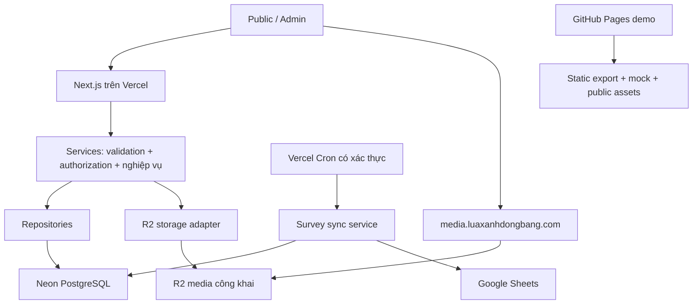

# Kế hoạch triển khai MVP sau landing page

Ngày lập/cập nhật: 27/09/2026. Trạng thái: **nền tảng, luồng đọc public và survey DB-intake code/test local đã triển khai; admin/auth, Google Sheets sync và cloud rollout vẫn là kế hoạch**. Survey mặc định tắt; chưa có cloud credential hoặc phê duyệt retention.

Phạm vi ban đầu: tài liệu cho dev; yêu cầu tiếp theo đã mở rộng sang triển khai core kết nối và DB-driven landing. Landing page được coi là đầu vào đã hoàn thành theo xác nhận của chủ dự án; không thiết kế lại giao diện. Chưa kiểm chứng tài khoản cloud, credentials, billing, domain hoặc kết nối thực tế.

Đọc cùng [hướng dẫn Neon/R2](neon-r2-setup.md) và [Architecture Decision](adr/0001-serverless-mvp.md). Baseline nghiệp vụ là bản “Technical Design – Solar Website MVP” do chủ dự án cung cấp.

**Bổ sung theo yêu cầu quản trị landing:** [thiết kế DB landing](landing-database-design.md) và [ADR-0002](adr/0002-landing-content-revisions.md) cung cấp canonical SQL cho catalog/media cùng cấu hình 10 section, chrome, SEO và draft/publish. SQL đã test local, chưa migrate Neon. Khi triển khai dùng schema đó thay mô tả sơ bộ catalog/media bên dưới; thêm `/admin/landing/`, validator, DTO ảnh và 2–3 dev-days dự kiến vào phạm vi MVP. Không tạo lại bảng cùng tên bằng một thiết kế cạnh tranh.

## 1. Hiểu: trạng thái hiện tại và phạm vi còn lại

### 1.1 Baseline trước khi triển khai core

Bảng này lưu hiện trạng lúc lập kế hoạch. Deployment hai target, async repositories, DTO ảnh, public API và tests hiện đã có; đường dẫn/status mới được ghi trong [backend-core.md](backend-core.md).

| Hạng mục | Hiện trạng ngày lập kế hoạch | Việc còn lại |
| --- | --- | --- |
| Runtime | `package.json`: Next.js 16.3.6, React 19.3.0; workflow dùng Node.js 22 | Giữ TypeScript/Node; khóa phiên bản dependency mới bằng lockfile |
| Deployment | `next.config.ts` luôn `output: "export"`; `.github/workflows/deploy-pages.yml` deploy `dev` | Hai build target từ cùng source, thêm Vercel runtime |
| Catalog | `src/services/catalog.ts` → `src/repositories/catalog.ts` → mock; API đồng bộ | Repository async và DTO public, adapter Neon |
| Public consumers | Trang chủ, `/du-an/`, `/thiet-bi/` gọi catalog; card dùng `imagePath()` ghép thư mục demo | Chuyển đồng bộ cả ba consumer và URL ảnh, giữ layout hiện tại |
| Survey | Trước đây mở `mailto:`; hiện có `POST /api/survey/`, migration PostgreSQL, consent, Turnstile/rate-limit gate và toast theo response commit | Cấu hình sandbox/production, chủ dự án duyệt privacy/retention; Google Sheets sync chưa triển khai |
| Auth/API/storage | Public-read API và survey POST đã có; admin/auth/CRUD/upload chưa triển khai | Login, phân quyền, admin, media upload và cloud config |
| Kiểm thử | `typecheck`, `build`, `test:export` | Integration/API/security tests và kiểm tra server build |
| Secrets | `.env.example` có tên biến; `.gitignore` bỏ `.env*` ngoại trừ example | Phân tách runtime/migration/preview secrets và kiểm tra artifact |

Checkout đang ở `dev`, có thay đổi landing page chưa commit từ trước. Khi thực hiện kế hoạch phải giữ các thay đổi đó, không reset/ghi đè hay coi chúng là phần backend đã hoàn thành.

### 1.2 Phạm vi MVP

- Public đọc Project/Equipment đã xuất bản; nội dung tĩnh, motion và các trang giải pháp tiếp tục dùng hiện trạng.
- Admin đăng nhập; CRUD Project, Equipment, người dùng; publish/hide; upload ảnh trong form.
- ROOT được bảo vệ ở server; ADMIN và USER có quyền cố định.
- Survey ghi Neon trước, đồng bộ Google Sheets có retry bền vững.
- `dev` vẫn deploy Pages; `main` deploy Vercel. Không VPS, process thường trú hay ổ đĩa local làm nơi lưu dữ liệu.

Ngoài MVP: analytics khách hàng, CRM, custom roles, workflow engine, media library, audit dashboard. Log kỹ thuật, retry, chống spam, phục hồi dữ liệu là yêu cầu vận hành tối thiểu, không phải Premium UI.

## 2. Thiết kế

### 2.1 Topology và ranh giới

`app/` chỉ làm routing/composition; `features/` giữ UI/validation từng tính năng; `services/` thực thi use case và quyền; `repositories/` giữ query; `infrastructure/` giữ SDK/config provider. Server Components gọi service trực tiếp, không HTTP vòng lại chính ứng dụng. Browser gọi API cùng origin. Module database/storage/auth đánh dấu `server-only`.

Chọn PostgreSQL trên Neon, `pg` + Drizzle cho query/schema/migrations và AWS SDK v3 cho R2 S3 API. Đây là lựa chọn đề xuất cho triển khai, chưa cài dependency. Dùng Node runtime để thống nhất driver, transaction và xử lý ảnh. Không thêm Edge runtime hoặc một backend riêng khi chưa có số đo đòi hỏi.

### 2.2 Hai build target, một application

**Không chỉ bật/tắt `output: "export"` rồi giữ nguyên route động trong bản Pages.** Static export không hỗ trợ request-time cookies, POST handlers, auth hay Server Actions. Cần loại server route khỏi đầu vào của build demo. Đã kiểm tra guide đi kèm bản Next cài tại `node_modules/next/dist/docs/01-app/02-guides/static-exports.md`.

Hợp đồng build đề xuất:

| Target | Routes/data | Output và secrets |
| --- | --- | --- |
| `DEPLOY_TARGET=demo` | Chỉ public routes; catalog và gửi khảo sát dùng mock phía client. Gửi thử hiện ngẫu nhiên thành công/thất bại, không gọi API hoặc lưu dữ liệu | Static `out/`, `/solar_demo`, noindex, không cloud secrets |
| `DEPLOY_TARGET=server` local/preview | Public + admin + API; Neon/R2 sandbox | Next runtime, base path rỗng, noindex, secrets sandbox |
| `DEPLOY_TARGET=server` production | Cùng source server đã kiểm thử | Vercel, domain chính, secrets production |

Dev sẽ xây `scripts/build-demo.mjs`: tạo bản sao source trong thư mục tạm; copy theo allowlist, không copy `.env*`, `.git`, `.next`, `out` hay credentials; bỏ `src/app/admin`, `src/app/api` và auth proxy nếu có **chỉ trong bản sao**; chọn mock adapter ở build time; build static rồi lấy `out/` về artifact. Không di chuyển/xóa routes trong working tree. Server build chạy source gốc. CI fail nếu manifest demo còn `/api` hoặc `/admin`, hoặc artifact chứa secret canary/server credentials. Typecheck source server chạy riêng để việc bỏ route ở demo không che lỗi server.

Đây là build packaging có kiểm thử, không phải duy trì hai bộ source hoặc hai project. Một biến build không phải ranh giới bảo mật; ranh giới thật là routes/artifacts và secrets theo môi trường.

Git vẫn chỉ có `dev` và `main`. Test backend trên Vercel Preview của `dev` với tài nguyên sandbox, không cần thêm nhánh staging. Preview dùng hostname cố định để OAuth callback có thể allowlist. Nếu chính sách không cho dùng preview cloud, dùng local server target với cùng sandbox; không thể nghiệm thu backend chỉ bằng Pages.

### 2.3 Neon và dữ liệu

- Runtime dùng pooled URL của role ứng dụng, không dùng owner. Migration dùng direct URL của role migration ở bước release được bảo vệ, không chạy trong request hay mỗi lần Vercel build.
- Pool nhỏ tái sử dụng theo instance; điểm khởi đầu `max=2`, connect timeout 5s, statement timeout 5s, đo lại bằng tải thực. Tổng kết nối tăng theo số instance; PgBouncer không biến DB thành tài nguyên vô hạn.
- Mỗi transaction dùng một checked-out client, release trong `finally`. Không gọi R2/Google trong transaction DB. Không dựa vào session-level `SET`/advisory lock trên transaction pool.
- Giữ PostgreSQL chuẩn, SQL parameterized; migration versioned, chạy một lần và có khóa chống hai release chạy đồng thời. Backup/restore trước migration nguy hiểm; expand → deploy → backfill → contract ở release sau.

Schema dưới đây là contract cần implement, không phải migration đã tồn tại:

| Bảng | Trường/ràng buộc cần có |
| --- | --- |
| `users` | ID theo adapter auth; email chuẩn hóa unique; tên; `role=ROOT/ADMIN/USER`; `active`; timestamps. Role không được nhận từ payload đăng ký |
| Auth support tables | Session/account/verification theo schema phiên bản thư viện đã pin; FK tới users. Không ép auth an toàn vào đúng 7 bảng nghiệp vụ |
| `projects` | UUID; title; slug unique; summary/content; location; category; system; status `DRAFT/PUBLISHED/HIDDEN`; cover media FK; version; timestamps |
| `equipment` | UUID; name; slug unique; category; summary/description; specifications JSONB object có giới hạn; status; cover media FK; version; timestamps |
| `media` | UUID; key unique; detected MIME; bytes; dimensions; state `PENDING/READY/DELETE_PENDING`; created_by; timestamps. URL dẫn xuất từ media origin + key, không nhận URL tùy ý từ client |
| `project_media`, `equipment_media` | FK entity/media; position; unique cặp entity/media và position trong entity. Cover phải thuộc gallery của chính entity |
| `survey_submissions` | UUID; idempotency_key unique; payload_hash; name/phone/email nullable; payload JSONB có schema version; consent version/time; created_at; sync state/attempts/next_attempt_at/lease_token/lease_until/error_code; `sheet_row` unique |
| Hỗ trợ chống abuse | Counter ngắn hạn trong DB hoặc rate-limit store managed; không dùng Map trong một server instance. Có TTL/cleanup |

`category`, `system` của Project phải được giữ vì landing page đang hiển thị. DTO public chuyển `equipment.name → title`, summary → description; `image` đổi thành URL/path hoàn chỉnh, thêm ID ổn định để React key không phụ thuộc title. Static UI assets vẫn dùng `imagePath`; card catalog không ghép prefix demo cho ảnh R2. Nội dung content/description là plain text trong MVP; không render HTML không tin cậy.

Index tối thiểu: `(status, created_at, id)` trên catalog; unique slug; FK indexes cho gallery; `(sync_status, next_attempt_at)` cho survey; session token unique/expiry theo auth adapter. Public lọc `PUBLISHED` trong SQL trước limit/count; admin cursor pagination mặc định 20, tối đa 100. Update dùng version để tránh hai admin ghi đè im lặng (`409`).

### 2.4 Auth và quyền cố định

**Đề xuất:** Better Auth với Google OIDC cho tài khoản nội bộ, session lưu DB; không public signup, không tự xây password/session protocol. Ngày D0 chủ dự án cần xác nhận đội vận hành có tài khoản Google phù hợp; nếu bắt buộc email/password, sửa ADR và cộng scope reset password/email delivery/MFA trước khi triển khai auth. Không coi lựa chọn OIDC là đã được chủ dự án phê duyệt.

User CRUD là quản lý quyền truy cập ứng dụng, không tạo/xóa Google account. Invite được nhập bởi ROOT/ADMIN; callback chỉ nhận verified identity khớp allowlist, liên kết provider subject một lần có kiểm soát. Không cho tự tạo account qua callback, tự đổi identity email hoặc auto-link provider tùy ý. Thư viện xử lý state/nonce/PKCE theo provider; server kiểm tra trusted origins và callback URL cố định.

| Hành động | ROOT | ADMIN | USER |
| --- | --- | --- | --- |
| Quản lý Project/Equipment/media | Có | Có | Chỉ đọc catalog đã xuất bản |
| List/create/update/disable/delete non-ROOT | Có | Có, chỉ gán ADMIN hoặc USER | Không |
| Xem/sửa/khóa/xóa ROOT qua User Management | Không hiển thị; chỉ công cụ quản trị bảo mật riêng | Không | Không |
| Tạo/gán role ROOT qua HTTP | Không | Không | Không |
| Survey trong admin | Chưa có màn hình trong MVP; sales dùng Sheet | Như ROOT | Không |

ROOT bootstrap bằng công cụ one-off, nhập identity qua secret channel, idempotent, không public endpoint. ROOT recovery yêu cầu operator cloud/DB, không đi qua User Management. Bảo vệ target ROOT trong query và service cho cả GET ID, list/count/search, update/delete, bulk và endpoint do auth library sinh. Kiểm tra actor từ session DB hiện tại cho mỗi thao tác; vô hiệu hóa cookie cache cho quyền nhạy cảm. Khóa/xóa/đổi role phải revoke sessions trong cùng transaction.

USER đăng nhập thì về `/du-an/`; ROOT/ADMIN về `/admin/projects/`. Không hứa USER có trang nội bộ chưa định nghĩa. Disable/delete tự thân bị chặn trong UI quản lý để tránh tự khóa; xóa user giữ FK lịch sử bằng nullable creator hoặc tombstone, không cascade xóa nội dung.

### 2.5 R2: upload ảnh có giới hạn rõ ràng

Giữ flow baseline: browser → API có auth → validate → R2 → metadata Neon. **Một request một ảnh, raw binary tối đa 3 MiB**, JPEG/PNG/WebP; không base64/multipart batch. Giới hạn này chủ động nằm dưới request cap 4.5 MB của Vercel. Upload nhiều ảnh bằng nhiều request, concurrency tối đa 2. [Giới hạn Vercel](https://vercel.com/docs/functions/limitations).

1. Xác thực ROOT/ADMIN, kiểm tra origin/CSRF, entity draft tồn tại và quyền sửa entity.
2. Reserve media ID/key và quota trong transaction ngắn. Khởi điểm quota 20 ảnh/entity, 50 MiB/entity tính cả pending; khóa row entity để hai upload không vượt hạn mức cùng lúc.
3. Đọc stream có bộ đếm byte; không chỉ tin Content-Length. Kiểm tra magic bytes, decode bằng thư viện ảnh được cập nhật, tối đa 20 megapixel. Re-encode WebP và bỏ EXIF; đây là chuẩn hóa an toàn tại server, không phải tính năng Media Premium. Giới hạn output 3 MiB.
4. Ghi key do server sinh: `projects/<entity-uuid>/<media-uuid>.webp` hoặc `equipment/...`; không tên người dùng/filename gốc, không overwrite key cũ. Chỉ ghi binary đã qua kiểm tra.
5. Transaction đánh dấu READY và gắn gallery; trả media ID + URL. Chỉ READY mới được chọn cover/publish. Nếu client timeout, retry bằng cùng upload operation ID trả kết quả cũ nếu READY; PENDING đang xử lý trả 409/Retry-After, không tạo bản sao.
6. Khi lỗi giữa R2/DB: giữ PENDING để reconciliation, không giả vờ rollback được cả hai hệ thống. Job maintenance chỉ xử lý pending quá TTL 24h, kiểm tra lại state/reference trước delete, có dry-run. Delete entity đánh dấu media DELETE_PENDING nếu hết reference; job xóa R2 idempotent rồi mới xóa metadata. Upload finalize phải kiểm tra entity vẫn còn tồn tại và không bị xóa.

Bucket production dùng custom domain `media.luaxanhdongbang.com`, tắt `r2.dev`. **Bucket này chỉ chứa ảnh marketing được phép công khai ngay từ lúc upload**: DRAFT/HIDDEN là trạng thái xuất hiện trong catalog, không phải quyền riêng tư của object URL. Không chứa hợp đồng, hồ sơ khách hàng, PII hay ảnh cần giữ bí mật đến ngày publish. Nếu cần bí mật draft, đổi sang private bucket + authenticated delivery trước khi upload thật; không dựa vào key khó đoán. Việc hide không xóa cache ảnh; yêu cầu gỡ bỏ phải xóa object và purge CDN riêng. [R2 public buckets](https://developers.cloudflare.com/r2/buckets/public-buckets/).

Chưa dùng presigned upload: không có nhu cầu ảnh lớn hơn 3 MiB và direct PUT làm việc kiểm tra nội dung phức tạp hơn. Khi có nhu cầu đo được, migration là private quarantine → presign ngắn hạn → validate/finalize → public immutable key; không ký upload trực tiếp vào bucket public rồi mới kiểm tra.

### 2.6 Survey và Google Sheets

Contract `POST /api/survey/` đã triển khai: JSON tối đa 16 KiB; `name`, `phone`, `location`, `building`, `bill`, `note?`, `consent`, `consentVersion`, `turnstileToken`; `Idempotency-Key` UUID được giữ khi retry. Không nhận `email`. Chuẩn hóa phone, giới hạn độ dài; building/bill dùng enum code ổn định, map từ label tiếng Việt. Response envelope thành công chỉ sau COMMIT DB: `201 {data:{id,status:"received"},requestId}`; frontend chỉ hiện toast thành công theo response này, không khẳng định đã đồng bộ Google.

- Verify Turnstile server-side (hostname/action) và rate limit dùng shared state. Mốc ban đầu 5 submission/10 phút theo khóa IP đã HMAC, cộng global budget; điều chỉnh sau đo false positive NAT. Không log raw IP/contact/payload.
- Cùng idempotency key + cùng payload nghiệp vụ trả cùng ID; khác payload trả `409`. Hash không gồm Turnstile token. Request retry vẫn chịu rate limit; sau lookup hợp lệ có thể trả generic receipt đã lưu, không trả dữ liệu cá nhân. Token Turnstile mới cần có cho request chưa commit.
- PostgreSQL migration tạo submission payload, consent/version/time, idempotency hash và bảng rate limit dùng chung. Ghi submission transactionally trước khi trả 201; Google Sheets sync/retry chưa có nên không có trạng thái PENDING/cron worker trong implementation hiện tại.
- Worker claim batch nhỏ bằng transaction/row lock `SKIP LOCKED`, lease token + deadline; commit trước khi gọi Google. Khi hoàn tất chỉ update DB nếu lease token vẫn khớp. Timeout 10s/call, batch 10, tối đa 2 calls đồng thời, lease 120s; dừng nhận việc mới trước deadline function. Retry backoff có jitter; lỗi permanent/chạm 10 lần → FAILED + cảnh báo kỹ thuật, replay qua script có quyền.
- Tránh append trùng khi Google đã nhận nhưng response mất: mỗi submission được cấp `sheet_row` cố định từ sequence DB bắt đầu từ 2; worker dùng `values.update` cùng range và `RAW`, chứa submission UUID. Retry ghi đè cùng giá trị. Tab `Raw_Submissions` là tab tích hợp được bảo vệ, không sort/insert/delete row vật lý; sales dùng filter view/tab khác. Payload submission bất biến; không cho hai nội dung khác nhau ghi cùng row. [Google Sheets writing](https://developers.google.com/workspace/sheets/api/samples/writing).
- Dự kiến cron mỗi 5 phút, mục tiêu sync trong 15 phút khi Google bình thường. Chọn plan scheduler đáp ứng; Vercel Hobby chỉ chạy daily nên không đáp ứng mục tiêu này. Preview/local chạy worker có kiểm soát với Sheet sandbox. [Cron limits](https://vercel.com/docs/cron-jobs/usage-and-pricing).

Không target nào còn mở email draft. Consumer form hiện dùng `SurveyForm`/`useSurveySubmission` của `@solar/ui/forms` với `mode: "demo"` tường minh ở cả demo/server build: chờ 700 ms, kết quả ngẫu nhiên 50/50, không gọi API và không lưu payload. Wrapper có disclosure thường trực và Toast thử nghiệm mặc định, không khẳng định đã nhận lead hoặc sẽ liên hệ. Hook lưu riêng mốc thời gian/cooldown qua key `solar:survey-rate-limit:v1`: mặc định 3 lần thành công trong 5 phút chặn 5 phút; lỗi không tính vào giới hạn, chỉ thành công reset RHF. Đây là giới hạn UX phía client, không thay shared rate limit server. Form chưa nối `POST /api/survey/`; khi tích hợp thật cần chuyển sang `mode: "live"` và async `onSubmit` xác nhận response thành công. Server chỉ bật intake thật khi có Turnstile keys, DB, rate-limit secret/global budget và `SURVEY_INTAKE_ENABLED=true`. Consent chưa tick sẵn; retention, thời hạn xóa và căn cứ xử lý dữ liệu phải được chủ dự án chốt trước khi bật intake thật. Không tự kết luận đã tuân thủ pháp luật chỉ vì có checkbox.

## 3. Validate security

| Threat / failure | Control bắt buộc | Bằng chứng nghiệm thu |
| --- | --- | --- |
| Gọi API trực tiếp, đoán ID ROOT, sửa role | Session DB + actor/target guard; allowlist field; không gán ROOT qua HTTP | Test mọi verb/ID và auth-library endpoints với ADMIN/USER |
| Account bị disable vẫn dùng cookie cũ | Revoke session và kiểm tra active/role mỗi request nhạy cảm | Cookie cũ bị từ chối ngay request kế tiếp |
| CSRF/XSS/SQL injection | Trusted origin + CSRF token cho mutation cookie-auth; plain text; parameterized SQL; security headers | Origin lạ, payload HTML/SQL không thực thi |
| Upload SVG/HTML, giả MIME, ảnh bomb, flood | Byte cap + decode/re-encode + pixel cap + quota reservation + shared rate limits | Test type giả, stream quá cỡ, ảnh quá pixel, hai upload race |
| Draft/hidden rò qua API | SQL filter trước paging/count; admin no-store/private; DTO allowlist | Anonymous không nhận title/summary/media reference của draft |
| Ảnh marketing public bị hiểu là private | Phân loại bucket rõ; không upload tài liệu bí mật | Chủ nội dung xác nhận loại dữ liệu; test không có raw upload chưa validate |
| DB/R2 write nửa chừng | Media state + reconciliation; FK/unique/transaction | Fault injection trước/sau PutObject và DB commit |
| Survey spam/PII lộ log hoặc Sheet public | Turnstile, shared limits, log redaction, Sheet share tối thiểu, retention | Kiểm tra log/artifacts và permission Sheet thực tế |
| Google lỗi/cron trùng invocation | Persist trước; claim/lease; deterministic row; retry và cảnh báo | Timeout sau Google write không tạo hàng trùng; worker chết phục hồi được |
| Preview đụng production | DB/bucket/Sheet/token riêng, sandbox synthetic data | Preview credential không truy cập được production |
| Mất DB/secret bị lộ | PITR/backup thực tế, restore drill, rotation/revocation | Restore sang target mới và rotate không in secret |

Các control trên là yêu cầu thiết kế, **chưa phải kết quả PASS**. Budget alerts phải bật ở Neon/R2/Vercel; autoscale có trần và không thay thế giám sát chi phí. Cookie Secure/HttpOnly/SameSite phù hợp OIDC; admin/API không dùng shared public cache; không cache response có session.

Public catalog ban đầu query request-time có pagination, không cache shared để publish/hide có hiệu lực ở request mới. Khi số đo DB/latency yêu cầu cache, bổ sung cơ chế invalidation đã test cả hide/delete và propagation; không chỉ đặt TTL rồi hứa ẩn ngay.

## 4. Đề xuất triển khai

### 4.1 Quyết định cần chốt tại D0

| Quyết định | Đề xuất | Ai chốt / ảnh hưởng nếu chưa chốt |
| --- | --- | --- |
| Domain | `luaxanhdongbang.com` theo brief; email form hiện dùng `.vn` | Chủ dự án xác nhận domain/email hợp lệ trước OAuth/DNS/copy |
| Login | Google OIDC allowlist; provider account ROOT bật MFA | Chủ dự án; nếu password login thì sửa scope auth |
| USER | Read-only catalog published; không survey/admin write | Chủ dự án; không tự mở rộng quyền |
| Public media | Chỉ ảnh được phép public ngay khi upload; 3 MiB/ảnh | Chủ nội dung; nếu cần private drafts phải đổi storage design |
| Chi phí/SLA | Plan cho cron 5 phút, sandbox riêng, backup window phù hợp | Chủ tài khoản cloud; xác nhận trên dashboard, không giả định free tier đủ |
| PII | Privacy notice, thời hạn giữ/xóa, Sheet recipients và nơi xử lý dữ liệu | Chủ dự án/người phụ trách dữ liệu; block intake thật nếu chưa chốt |

Không chờ các quyết định này để làm build boundary, schema catalog và test sandbox; không triển khai phần phụ thuộc theo giả định ngầm.

### 4.2 Work breakdown và đầu ra

Mục tiêu một tuần chỉ khả thi khi D0 có đủ tài khoản/quyết định và có **2 dev cùng QA hỗ trợ**. Đây là ước lượng kế hoạch, không phải cam kết; với 1 dev dự trù 8–12 ngày làm việc. Không rút ngắn bằng cách bỏ auth, retry hoặc restore test.

| Mốc | Công việc và file/module đích | Phụ thuộc | Exit gate |
| --- | --- | --- | --- |
| D0 | Chốt bảng trên; tạo sandbox/prod theo runbook; lập inventory credentials không chứa giá trị | Owner cloud | Tài nguyên, quyền và region được ghi nhận; không dùng dữ liệu thật ở sandbox |
| D1 | `scripts/build-demo.mjs`, config targets, repo interface async, CI hai build; dependency pin | Landing page hiện tại | Pages build không secrets; server build không export; cả hai không phá canonical/basePath |
| D2 | `database/schema`, `migrations`, synthetic seeds; `infrastructure/database`; auth adapter/services; bootstrap ROOT | D0/D1 | Runtime không DDL; migration chạy lại an toàn; auth/ROOT security tests |
| D3 | `features/projects`, `features/equipment`, CRUD services/repos/API/admin screens; draft/publish/hide | D2 | CRUD/slug/version/FK/pagination pass; public chỉ thấy published |
| D4 | `infrastructure/storage`, media service/API, gallery form, maintenance script; thay DTO ảnh public | D2/D3 | Ảnh hợp lệ đi hết flow; adversarial/race/failure cases pass |
| D5 | Survey API/UI, Turnstile/limits, sync worker, Sheet sandbox, cron contract | D2; Google access | Neon commit trước Google; retry/replay không mất/trùng lead |
| D6 | User Management, matrix ROOT/ADMIN/USER, integration/E2E; restore/rotation drill; tải thử | D3–D5 | Security gates và recovery pass; xử lý hết lỗi nghiêm trọng |
| D7 | UAT preview, nội dung/ảnh duyệt; migration prod, promote release, DNS và smoke test | Toàn bộ gate | Bằng chứng release + rollback rehearsal; owner nhận bàn giao |

Đây là phân công cho đội triển khai trong tương lai, không phải yêu cầu chạy agent hoặc triển khai trong lượt viết tài liệu này.

Các command **đã có**: `build:demo`, `build:server`, `db:migrate`, `db:seed:sandbox`, `test:core`, `test:integration`, `smoke:cloud`. Migration dùng canonical SQL và checksum, không có `db:generate`/Drizzle. `smoke:cloud` mặc định read-only; `--write` tạo/xóa ảnh synthetic sandbox, không in URL DB/token. `test:e2e` cho admin, `media:reconcile`, `survey:replay` còn phải triển khai.

### 4.3 API contract tóm tắt

| Endpoint đề xuất | Actor / yêu cầu |
| --- | --- |
| Auth routes theo thư viện đã pin | OIDC allowlist, state validation; vô hiệu các endpoint signup/link/delete-account ngoài scope |
| `/api/admin/projects/`, `/api/admin/projects/:id/` | ROOT/ADMIN; list/create/read/update/delete; publish/hide là field status được validate |
| `/api/admin/equipment/`, `/api/admin/equipment/:id/` | Như projects |
| `/api/admin/media/?entityType=...&entityId=...` | ROOT/ADMIN; POST raw bytes + idempotency key; ID/type allowlist; MIME header chỉ là khai báo |
| `/api/admin/media/:id/` | Delete có kiểm tra reference; không nhận key/path tùy ý |
| `/api/admin/users/`, `/api/admin/users/:id/` | ROOT/ADMIN; target non-ROOT; field allowlist; revoke sessions |
| `/api/survey/` | Public; schema/Turnstile/rate-limit/idempotency; không endpoint public list/GET survey |
| `/api/internal/survey-sync/` | Scheduler credential server-side; batch bounded; không user role thay cron secret |

Error envelope `{error:{code,message,requestId}}`, không stack/SQL/credential. HTTP `400` sai input, `401` chưa login, `403` thiếu quyền, `404` không có target/ROOT bị che với non-ROOT, `409` conflict, `413` quá kích thước, `415` sai media, `429` quá tần suất, `503` dependency unavailable. Không trả 200 giả thành công khi DB lỗi.

### 4.4 Kiểm thử và Definition of Done

- [x] Core hiện tại đã chạy typecheck, build demo/server, test export, core tests và PostgreSQL/Next HTTP integration local. Đây chưa phải nghiệm thu cloud hoặc admin MVP.
- [ ] CI demo không cloud secrets, export không admin/API, links/images/canonical của landing page vẫn pass.
- [ ] Server build test với sandbox; missing required env fail rõ, không fallback sang mock trong production.
- [ ] Integration trên Postgres thật: transaction, unique/FK, concurrent version update, ROOT target guard, session revoke, query scope trước paging.
- [ ] Storage smoke với bucket sandbox; fault tests cho DB/R2 partial write, retry idempotent và cleanup không xóa media còn reference.
- [x] Survey integration local: commit-before-201, same-key retry, payload collision `409`, enum/consent validation, 16 KiB cap và per-IP rate limit.
- [ ] Chưa kiểm concurrent retry/race, Turnstile Cloudflare thực tế, Google timeout/403/429, Sheets worker/lease recovery và raw cell injection.
- [ ] E2E login → tạo draft → upload gallery → publish → public xem → hide/delete; USER và anonymous bị từ chối write.
- [ ] Thử tải sandbox 50 public reads đồng thời và 10 submissions/giây trong 5 phút bằng synthetic data; ghi p50/p95/error/pool saturation, báo riêng cold start. Mục tiêu đề xuất p95 API warm ≤ 1.5s, lỗi ngoài lỗi input < 1%; chưa có số đo xác nhận năng lực.
- [ ] Kiểm tra browser 320–1440px, keyboard, lỗi form và trạng thái đang gửi/retry; survey demo/server đúng copy.
- [ ] Restore Neon sang target mới; kiểm tra media key tương thích; xác minh backup retention thực tế. R2 không mặc định được coi là có bản backup phục hồi object đã xóa.
- [ ] ROOT recovery, secret rotation, cron monitoring, retention và người chịu trách nhiệm sự cố được bàn giao.
- [ ] Production smoke có bằng chứng thời điểm/deployment ID; không còn Major security/business issue. Không đánh dấu MVP done chỉ vì Neon/R2 connect thành công.

### 4.5 Release và rollback

1. Chụp trạng thái deployment/schema đang chạy; kiểm tra backup window và restore thử. Chặn merge `main` nếu CI/UAT/security gate chưa đạt.
2. Chạy migration additive bằng credential release riêng trước promotion; không chạy destructive migration cùng lần deploy ứng dụng phụ thuộc schema cũ.
3. Seed ROOT qua one-off operation; nhập catalog từ mock chỉ khi nội dung/ảnh đã duyệt và có slug/ID mapping. Không đưa dữ liệu minh họa thành published tự động.
4. Deploy Vercel với `SEO_INDEXABLE=false`, test hostname HTTPS, env scope, session cookie, CRUD, upload, survey + Sheet production bằng một lead kiểm thử có đánh dấu.
5. Cutover DNS theo giá trị Vercel/Cloudflare cung cấp thực tế; giữ nguyên MX/TXT email. Kiểm tra redirect URL cũ theo inventory thật và `trailingSlash` hiện tại; không tự suy diễn toàn bộ site cũ.
6. Bật index cho trang đủ điều kiện sau xác nhận nội dung/domain, redeploy để cập nhật metadata. Admin/survey/preview tiếp tục noindex; auth mới là bảo vệ admin.
7. Nếu lỗi ứng dụng: rollback deployment về bản tương thích schema hiện tại, giữ dữ liệu Neon. Nếu phải quay về landing page/mailto cũ: tắt intake mới, giữ submission đã nhận và tiếp tục đối soát/sync; thông báo rõ kênh nhận lead đang dùng.
8. Nếu lỗi schema/dữ liệu: dừng write, restore sang DB mới, đối soát submission/media phát sinh sau recovery point rồi chuyển connection; không restore đè mù làm mất lead đã nhận.

## 5. Trạng thái bàn giao tài liệu

- [x] Đối chiếu scope với source hiện tại và giới hạn nền tảng bằng tài liệu chính thức.
- [x] Có Architecture Decision, kế hoạch module, runbook kết nối và tiêu chí nghiệm thu.
- [ ] Chưa tạo Neon/R2/Vercel resources, chưa cấu hình secrets/DNS.
- [x] Có dependencies đã pin, migration/seed runner, public API, PostgreSQL/R2 adapters và frontend đọc nội dung đã published; kiểm thử local.
- [ ] Auth/admin, Google Sheets sync, upload HTTP/finalize và MVP runtime trên cloud chưa hoàn tất; survey DB intake mới được kiểm thử local, chưa cấu hình cloud hay phê duyệt retention.
- [ ] Các quyết định D0 chưa được chủ dự án phê duyệt trong lượt này.

Nguồn kỹ thuật bổ sung: [Neon pooling](https://neon.com/docs/connect/connection-pooling), [Neon Node.js](https://neon.com/docs/guides/node), [Better Auth database](https://www.better-auth.com/docs/concepts/database), [Better Auth Google](https://www.better-auth.com/docs/authentication/google), [Better Auth session management](https://www.better-auth.com/docs/concepts/session-management), [Turnstile server validation](https://developers.cloudflare.com/turnstile/get-started/server-side-validation/). Dev phải đối chiếu API của version thực tế đã pin khi bắt đầu; tài liệu này không thay thế compile/integration test.
