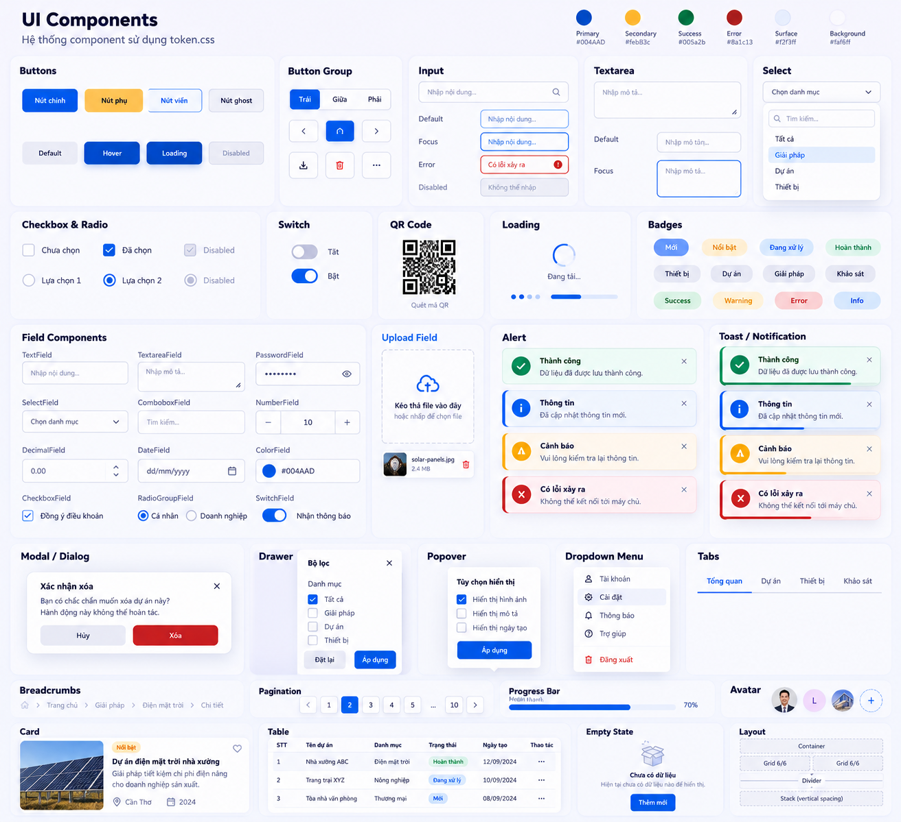

# Solar UI composition — Atomic Design

Tài liệu này sở hữu composition và ranh giới UI của website Solar. Visual canonical nằm ở [DESIGN.md](../DESIGN.md); [v1 nguyên bản](../design-v1.md) được giữ để truy lịch sử. Tài liệu được tách từ v1 ngày 2026-10-01; contracts package chuyên biệt được quyết định ở UI system architecture khi chi tiết lịch sử trong bản composition chưa được tái nghiệm thu.

Tài liệu này mô tả cách compose UI riêng của website Solar. Kiến trúc bộ chuẩn React dùng lại giữa các dự án, theme/token và contracts của package được quy định tại [docs/ui-system-architecture.md](ui-system-architecture.md). Quy tắc CSS dùng chung nằm tại [docs/css-conventions.md](css-conventions.md).

## UI component reference

Ảnh gốc 1312 × 1199 px là chuẩn nghiệm thu giao diện cho `@solar/ui` trong repo `component-ui`; các ô chứa state minh họa (focus, disabled, loading, open). Bản preview của package phải hiển thị component thật và cho phép kiểm tra tương tác; không thay UI bằng ảnh tĩnh. Quy tắc responsive và accessibility vẫn áp dụng ở kích thước nhỏ hơn ảnh.

## Goal

Build the supplied UI as reusable defaults for the existing site, not as a catalog/showcase page. Keep routes and content in their existing owners. Composition runs upward through atoms → molecules → organisms → sections → screens; pages pass data/children and do not contain repeated UI implementation.

## Layer contract

| Layer | Modules | Contract |
| --- | --- | --- |
| Atoms | `src/components/atoms/action-link.tsx`, `range-input.tsx` | Small semantic controls, style variants, and explicit value/handler props. No campaign copy or screen composition. |
| Molecules | `src/components/molecules/section-heading.tsx`, `savings-estimator.tsx`, `faq-disclosure.tsx`, `comparison-panel.tsx`, `process-step.tsx`, `testimonial-card.tsx` | Compose atoms or semantic elements behind typed content props. Stateful behavior belongs only to the estimator/disclosure. |
| Organisms | `src/components/organisms/announcement-bar.tsx`, `conversion-dock.tsx`, `site-chrome.tsx`; `src/features/survey/survey-form.tsx` | Reusable global/form UI. Brand, nav, announcement, footer, form labels/options, email, and destinations arrive through props from content data. |
| Sections | `src/components/sections/*-section.tsx` | Page-level groups assembled from molecules/organisms; accept typed data and child slots. No route-level duplicate markup. |
| Screens | `src/components/screens/home-screen.tsx`, `survey-screen.tsx`, `solutions-overview-screen.tsx`, `detail-overview-section.tsx`, `service-overview-screen.tsx` | Compose typed content into pages. `/giai-phap/` follows the complete `public/images/demo/Giải pháp.png` layout and copy, with all source images omitted; building-type anchors remain available to home cards. |
| Routes | `src/app/(public)/page.tsx`, `(public)/giai-phap/page.tsx`, `(public)/dich-vu/page.tsx`, `(public)/khao-sat/page.tsx`, and `src/app/layout.tsx` | Peer-level route pages; solution category links and service details use anchors on their overview routes. |

Solar imports app-owned global tokens and styles from `src/styles/`. During migration, shared package components use colocated CSS Modules and the semantic token contract; Solar sections and screens remain app-owned. Keep app typography on the existing semantic tokens, avoid conflicting token sources, duplicated shared controls, or duplicated section markup.

## Component map

| Design item | Atomic composition | Current integration |
| --- | --- | --- |
| C-01 Announcement | `AnnouncementBar` organism receives message children and action props | Global `RootLayout`; dismissible. |
| C-02 Sticky navigation | `SiteHeader` organism receives brand, nav links, and CTA props | Global `RootLayout`; responsive details menu and sticky offset. |
| C-03 Hero | `HeroSection` composes `ActionLink` atoms with hero content props | `HomeScreen`. |
| C-04 Savings calculator | `SavingsCalculatorSection` receives `SavingsEstimator`; estimator composes `RangeInput` and `ActionLink` | Reusable, intentionally not composed into `HomeScreen`. |
| C-05 Benefit/solution cards | `SolutionsSection` composes cards from typed solution data and action destination | `HomeScreen`. |
| C-06 Before/after | `BeforeAfterSection` receives before/after `ComparisonPanel` children | Reusable, intentionally not composed into `HomeScreen`. |
| C-07 Process | `ProcessTimelineSection` maps process data to `ProcessStep` molecules | Reusable, intentionally not composed into `HomeScreen`. |
| C-08 Testimonial | `TestimonialSection` maps typed entries to `TestimonialCard` molecules | It renders nothing for an empty list. No approved testimonial data exists; do not fabricate a quote or attribution. |
| C-09 Lead form | `SurveyScreen` composes the prop-driven `SurveyForm` feature | Existing survey route; retains five required fields and opens an email draft. |
| C-10 FAQ | `FaqSection` maps content to native `FaqDisclosure` molecules | `HomeScreen`; keyboard-accessible `
/
`. |
| Breadcrumb | `src/components/molecules/breadcrumbs.tsx` receives label/href items; the current page uses `aria-current` | Project, equipment, service, and survey routes; `src/lib/seo.ts` uses the same items for `BreadcrumbList` without client-side JS. |
| C-11 Floating CTA | Right-fixed vertical stack of Zalo, phone, and survey icon actions | Global `RootLayout`; survey is active. Zalo and phone render disabled until verified destinations are supplied. |
| C-12 Service overview | `ServiceOverviewScreen` composes a service hero and four `ServiceStage` entries from typed content | `/dich-vu/`; hero and process photos use existing demo assets. The process line starts at the hero photo edge, crosses the stage images, and stops inside the last image; mobile follows the numbered-step gutter instead. Stages 2 and 4 retain their tinted surface, rounded corners, and soft shadow on mobile as well as desktop. |

## Reference UI controls

- `SectionHeading` molecule của Solar là adapter cho `@solar/ui` SectionHeading; package sở hữu markup và baseline CSS, app sở hữu palette/scale/breakpoint. Before/after và process timeline cũng dùng adapter. Xem [ADR extraction](adr/0002-section-heading-extraction.md).

- `@solar/ui` in `packages/ui/` is the `component-ui` Git submodule; shared controls, fields, feedback, and navigation are public package exports. Do not add duplicate shared implementations to `src/components/ui/`.
- `src/features/catalog/` owns Solar-specific catalog cards; `src/features/survey/` adapts shared form controls and validation while retaining the demo email-draft behavior. `src/components/` owns Solar composition, sections, and chrome.
- During migration, existing local `ProjectCard`, `EquipmentCard`, and other UI components remain app-owned until their consumers move to package exports. `Toast` takes `tone`, text, `onDismiss`, and optional duration; hover/focus pauses dismissal. `ConfirmDialog` and `Pagination` use controlled state. `Choice` and `Switch` use native checkbox/radio state; `FeatureCard` owns its favorite mark.
- `NumberField` accepts controlled `value`/`onValueChange` or `defaultValue`; callback/form values preserve unformatted decimal-comma text and trailing zeros while the visible input groups thousands. Do not convert through floating point or truncate precision.
- Package prop, theme, and state contracts: [docs/ui-system-architecture.md](ui-system-architecture.md); visual reference: `docs/ui-components-reference.png`.

## Content and behavior

- `src/data/content/solutions.ts` owns the three solution details shared with home cards; `src/data/content/services.ts` owns the three service details shared with service rows and navigation.
- `src/data/content/service-overview.ts` owns the overview hero and four process stages. Timing, technical, and warranty copy comes from the user-provided image and remains pending real-world confirmation.
- `src/data/content/site-chrome.ts` owns global brand, nav, announcement, footer, and conversion destinations. Desktop Giải pháp/Dịch vụ menus open on hover/focus and close on page scroll; mobile uses nested native disclosures that both collapse on page scroll.
- `src/data/content/survey.ts` owns survey-screen copy and form labels/options. `SurveyForm` receives its content as props.
- The reusable estimator accepts assumptions and explanatory copy as props. The sample's illustrative 82% savings and 1.36 kWp-per-million-bill assumptions are not a quote or guarantee.
- The survey form is not presented as server-side lead capture. No form submission is claimed unless a real endpoint is added.
- C-08 stays absent from the rendered screen until approved customer quote/attribution data is supplied.
- Search metadata và JSON-LD thuộc `src/lib/seo.ts` và `src/components/seo/json-ld.tsx`, không trộn vào section nội dung. Quy tắc xuất bản và giới hạn dữ liệu xem `docs/seo-aeo-review.md`.
- Ảnh minh họa trong `public/images/demo/` dùng WebP lossless thay PNG; giữ nguyên pixel, alt và bố cục.

## Motion contract

- `src/app/(public)/layout.tsx` gắn `MotionRuntime` một lần cho route công khai. Runtime hiện đọc token hero/reveal 2000ms; target thường dịch 32px desktop / 16px mobile, hero dịch 48px / 24px. Services trang chủ hiện dùng view timeline cho media/list với keyframe 0/18/35/100%; mô tả cũ về từng hàng 0/12/24/36% và exit 89–100% được giữ trong v1 làm lịch sử, không còn là contract hiện hành. Reduced-motion giữ nội dung tĩnh theo các nhánh runtime/CSS tương ứng.
- `/giai-phap/` theo đầy đủ ảnh tham chiếu: nhu cầu, hệ thống, loại công trình, bốn bước EPC, mô hình đầu tư và CTA cuối. Nội dung chỉ gồm chữ và bề mặt dùng token; reveal chạy qua `MotionRuntime` sẵn có.
- `PartnersMarquee` giữ một hàng tên đối tác SSR, chỉ nhân đôi hàng thứ hai sau hydration khi đủ chỗ chạy. Tạm dừng tự động khi hover/chạm, tab ẩn hoặc ngoài viewport; không có nút điều khiển. Khi không có JS hoặc `prefers-reduced-motion`, tên vẫn hiện tĩnh.
- `src/styles/tokens.css` định nghĩa motion/elevation; `src/styles/components.css` áp dụng hover card, FAQ, CTA, view-timeline services và reduced-motion. Lenis RAF chỉ phục vụ desktop scrolling, không điều khiển section animation. Hợp đồng xem `docs/animation-plan.md`.

## Verification lịch sử

Các kết quả bên dưới thuộc đợt Atomic Design trước đây; không chứng nhận working tree hiện tại. Kiểm tra mới và giới hạn nằm tại [design browser evidence](design-browser-evidence.md).

- `npm run typecheck`, `npm run build`, and `npm run test:export` passed after the Atomic Design refactor.
- Browser smoke used the configured `/solar_demo/` base path: slider updated at maximum, FAQ opened by keyboard, announcement dismissed, populated section counts rendered, and internal links kept the base path.
- At 390px, mobile navigation opened by keyboard and document width equaled viewport width. Survey route retained five required fields and rejected an empty form.
